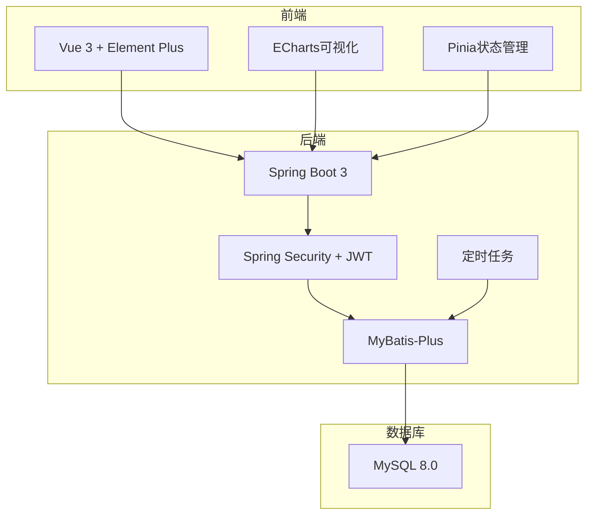

# 儿童绘本阅读行为分析与成长跟踪系统

## 项目概述

本系统是一个基于大数据分析的儿童绘本阅读行为分析与成长跟踪平台，通过收集儿童在数字化绘本阅读过程中的行为数据，利用大数据分析技术（聚类、序列分析等）挖掘阅读习惯、专注度、兴趣偏好，构建成长跟踪模型，为家长和教育机构提供科学的阅读反馈和个性化绘本推荐。

## 技术栈

### 后端
- Spring Boot 3.x
- Java 17
- Maven 3.8+
- MySQL 8.0
- MyBatis-Plus
- Spring Security + JWT

### 前端
- Vue 3
- Element Plus
- Axios
- ECharts
- Node.js 18

## 项目结构

```
bishe/
├── backend/                    # 后端项目
│   ├── src/main/java/com/picturebook/
│   │   ├── controller/         # 控制器层
│   │   ├── service/            # 服务层
│   │   ├── mapper/             # 数据访问层
│   │   ├── entity/             # 实体类
│   │   ├── dto/                # 数据传输对象
│   │   ├── vo/                 # 视图对象
│   │   ├── config/             # 配置类
│   │   ├── security/           # 安全模块
│   │   ├── task/               # 定时任务
│   │   └── utils/              # 工具类
│   └── src/main/resources/
│       └── application.yml     # 配置文件
├── frontend/                   # 前端项目
│   ├── src/
│   │   ├── api/                # API接口
│   │   ├── components/         # 组件
│   │   ├── views/              # 页面
│   │   ├── router/             # 路由
│   │   ├── stores/             # 状态管理
│   │   ├── utils/              # 工具类
│   │   └── styles/             # 样式
│   └── package.json
└── sql/
    └── schema.sql              # 数据库脚本
```

## 环境配置

### 数据库配置
1. 安装MySQL 8.0
2. 创建数据库：`CREATE DATABASE picture_book DEFAULT CHARACTER SET utf8mb4;`
3. 执行 `sql/schema.sql` 创建表结构和初始数据

### 后端配置
修改 `backend/src/main/resources/application.yml`：
```yaml
spring:
  datasource:
    url: jdbc:mysql://localhost:3306/picture_book?useSSL=false&serverTimezone=Asia/Shanghai
    username: root
    password: 123456
```

### 前端配置
前端代理配置在 `frontend/vite.config.js` 中已配置，默认代理到 `http://localhost:8080`

## 启动步骤

### 1. 启动后端
```bash
cd backend
mvn spring-boot:run
```

### 2. 启动前端
```bash
cd frontend
npm install
npm run dev
```

### 3. 访问系统
- 前端地址：http://localhost:3000
- 后端地址：http://localhost:8080

## 测试账号

| 角色 | 用户名 | 密码 |
|------|--------|------|
| 管理员 | admin | admin123 |
| 教师 | teacher | teacher123 |
| 家长 | parent | parent123 |

## 功能模块

### 1. 用户登录与权限管理
- 三级权限体系：管理员(ADMIN)、教师(TEACHER)、家长(PARENT)
- JWT令牌认证
- 登录失败次数限制

### 2. 阅读行为数据采集
- 阅读日志提交
- 数据清洗与聚合
- 定时任务处理

### 3. 行为分析模型
- K-Means聚类分析阅读类型
- 兴趣偏好分析
- 专注度指标计算

### 4. 成长跟踪与评估
- 多维成长评价体系
- 成长报告生成
- 成长曲线展示

### 5. 个性化绘本推荐
- 协同过滤推荐
- 同龄人热门推荐
- 基于内容推荐

### 6. 数据可视化看板
- 家长看板
- 机构看板
- 管理员看板

### 7. 绘本分类管理
- 四级分类体系
- 细分类型管理

### 8. 批量数据管理
- Excel批量导入
- 数据导出

## 核心算法

### K-Means聚类分析
用于将儿童阅读行为分为三类：
- 专注型：阅读时注意力集中，能完整阅读
- 跳跃型：翻页较快，可能对某些内容不感兴趣
- 兴趣导向型：阅读行为受兴趣驱动明显

### 协同过滤推荐
基于用户历史行为数据，推荐相似用户喜欢的绘本。

### 专注度计算
根据平均单页停留时间、翻页速度波动等指标计算专注度评分。

## 系统架构图



## 数据库E-R图

```mermaid
erDiagram
    USER ||--o{ CHILD : "binds"
    USER }o--|| ROLE : "has"
    CHILD }o--|| CLASS : "belongs_to"
    CHILD ||--o{ READING_LOG : "creates"
    CHILD ||--o{ ANALYSIS_RESULT : "has"
    CHILD ||--o{ GROWTH_REPORT : "has"
    CHILD ||--o{ RECOMMENDATION : "receives"
    BOOK ||--o{ READING_LOG : "read_in"
    BOOK }o--|| CATEGORY : "belongs_to"
```

## 注意事项

1. 确保MySQL服务已启动
2. 确保Node.js版本 >= 18
3. 确保Java版本 >= 17
4. 首次运行需要执行数据库脚本

## 作者

毕业设计项目 - 儿童绘本阅读行为分析与成长跟踪系统
