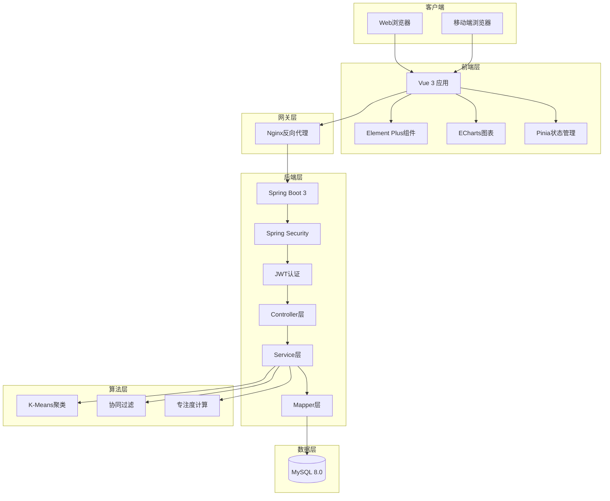
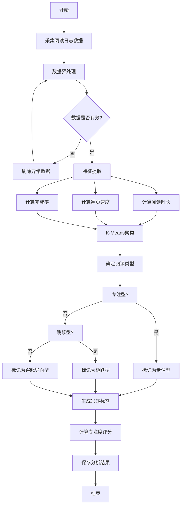
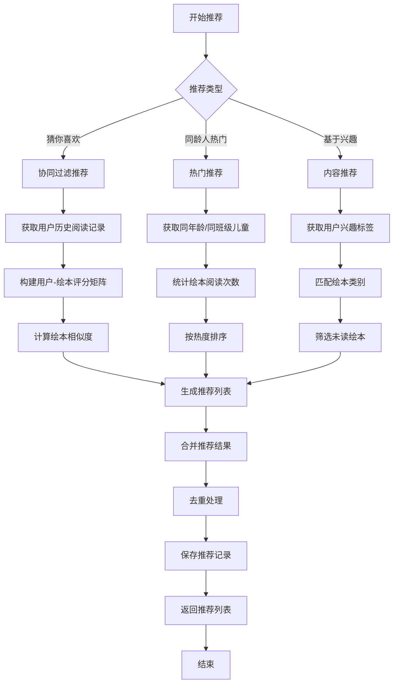
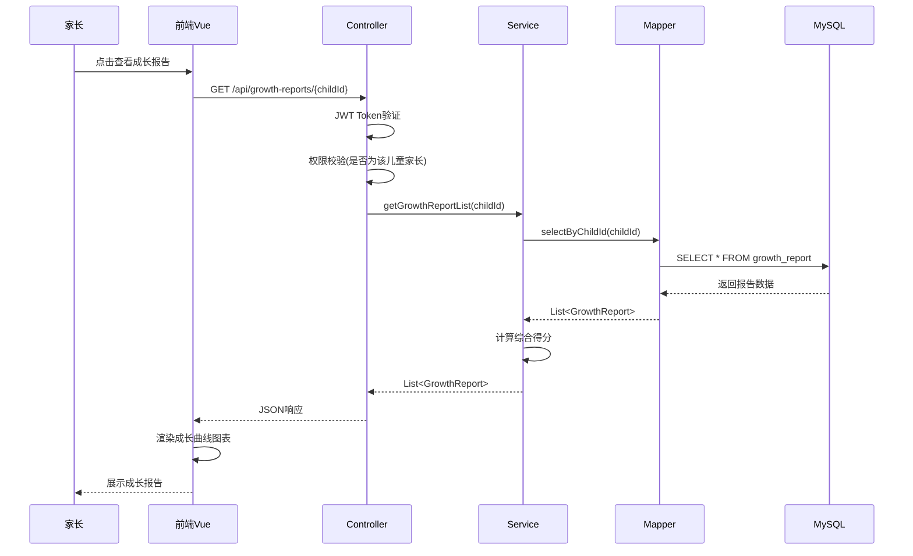
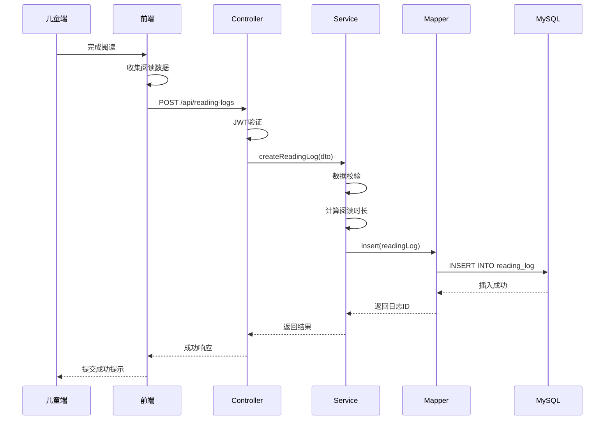
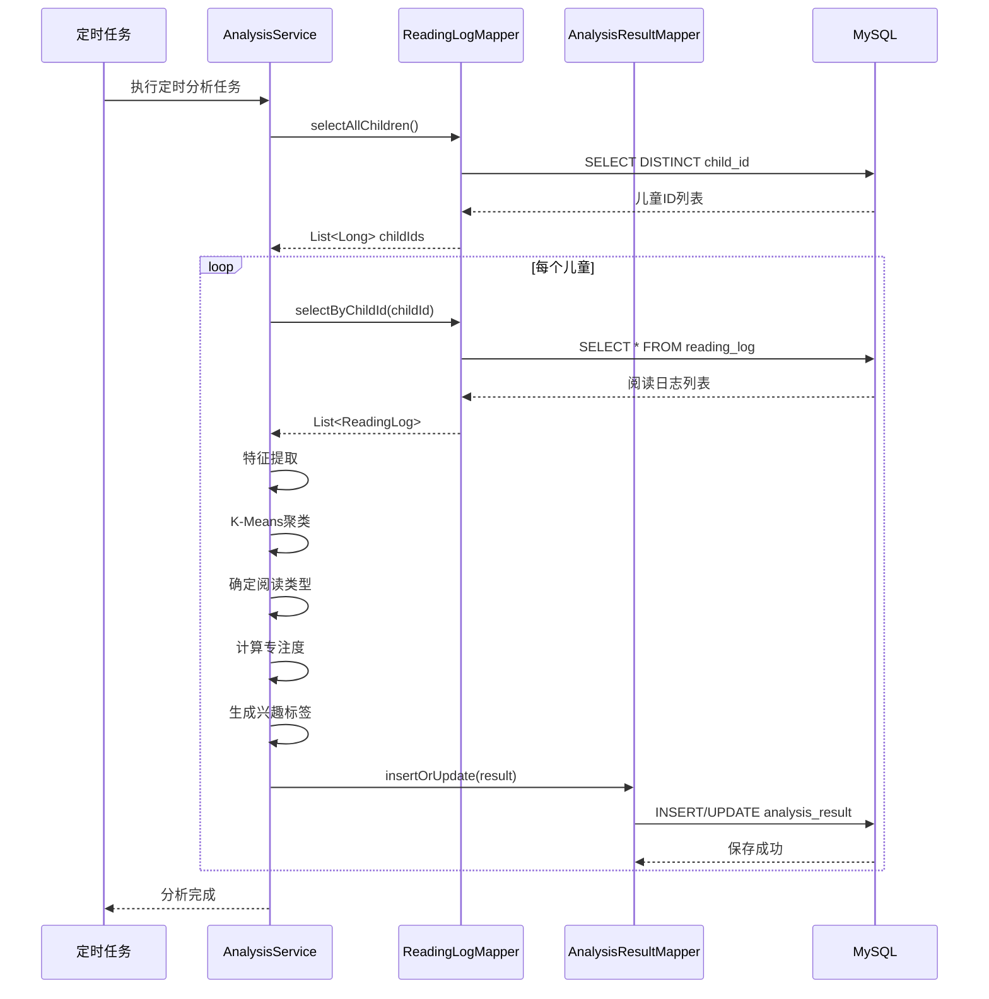
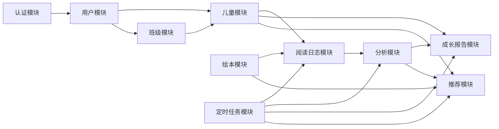
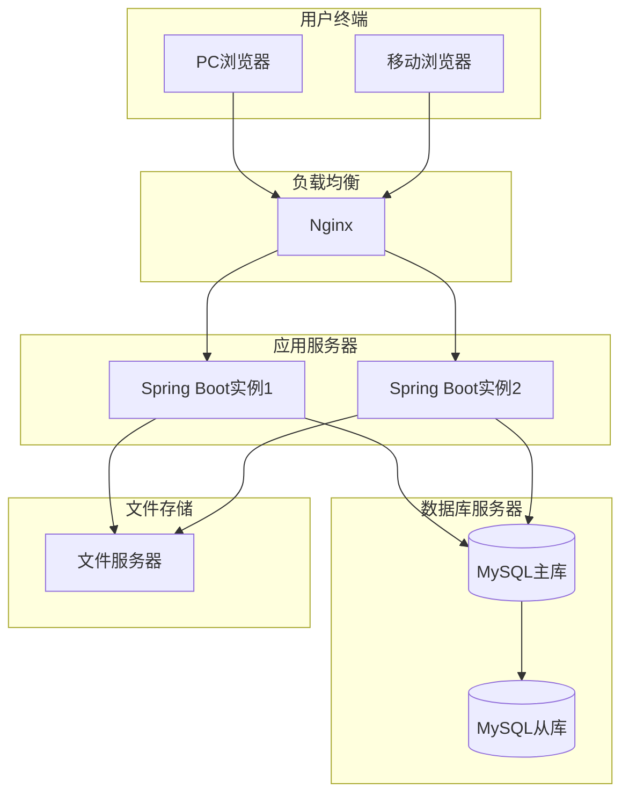
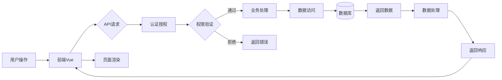

# 系统设计文档

## 1. 系统整体架构图



## 2. 数据库E-R图

```mermaid
erDiagram
    USER {
        bigint id PK
        varchar username
        varchar password
        varchar real_name
        varchar phone
        varchar role
        int status
        datetime create_time
    }
    
    ROLE {
        bigint id PK
        varchar role_name
        varchar role_key
        varchar description
    }
    
    CLASS {
        bigint id PK
        varchar name
        varchar description
        datetime create_time
    }
    
    CHILD {
        bigint id PK
        varchar name
        int age
        char gender
        date birth_date
        bigint class_id FK
        bigint parent_id FK
        varchar reading_type
        datetime create_time
    }
    
    BOOK {
        bigint id PK
        varchar title
        varchar author
        varchar category
        varchar sub_category
        varchar difficulty
        int page_count
        int read_count
        text description
        datetime create_time
    }
    
    READING_LOG {
        bigint id PK
        bigint child_id FK
        bigint book_id FK
        datetime start_time
        datetime end_time
        text page_durations
        int page_views
        tinyint completed
        datetime create_time
    }
    
    ANALYSIS_RESULT {
        bigint id PK
        bigint child_id FK
        varchar reading_type
        double focus_score
        text interest_tags
        text cluster_features
        datetime create_time
    }
    
    GROWTH_REPORT {
        bigint id PK
        bigint child_id FK
        varchar report_type
        int vocabulary_score
        int logic_score
        int reading_score
        int focus_score
        int overall_score
        text recommendations
        datetime create_time
    }
    
    RECOMMENDATION {
        bigint id PK
        bigint child_id FK
        bigint book_id FK
        varchar recommend_type
        double score
        datetime create_time
    }
    
    USER ||--o{ CHILD : "binds"
    USER }o--|| ROLE : "has"
    CHILD }o--|| CLASS : "belongs_to"
    CHILD ||--o{ READING_LOG : "creates"
    CHILD ||--o{ ANALYSIS_RESULT : "has"
    CHILD ||--o{ GROWTH_REPORT : "has"
    CHILD ||--o{ RECOMMENDATION : "receives"
    BOOK ||--o{ READING_LOG : "read_in"
    BOOK ||--o{ RECOMMENDATION : "recommended"
```

## 3. 阅读行为分析算法流程图



## 4. 推荐算法逻辑图



## 5. 核心模块时序图

### 5.1 家长查看成长报告时序图



### 5.2 阅读日志提交流程时序图



### 5.3 行为分析流程时序图



## 6. 模块依赖关系图



## 7. 部署架构图



## 8. 数据流程图


